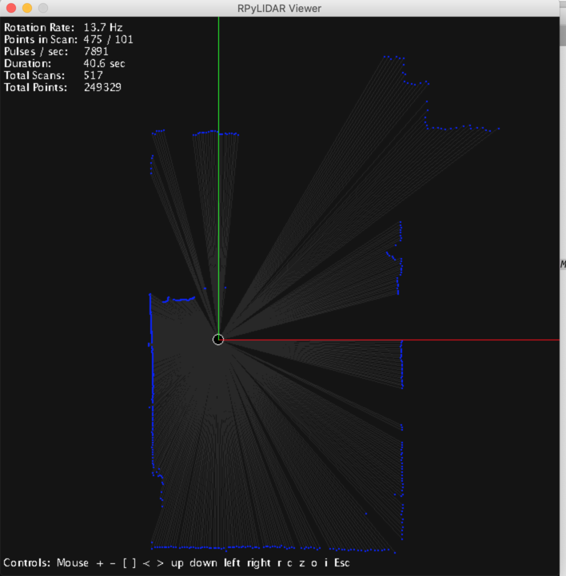

# RPyLIDAR
Python 3 driver and integrated PyGame point cloud viewer for RPLIDAR sensors

&emsp;&emsp;&emsp;

Python dependencies:

&emsp;[PySerial](https://pythonhosted.org/pyserial/) 
&emsp;[PyGame](https://www.pygame.org)

## NOTES:
- The code has operating system (OS) specific lines of code to ensure proper fonts and file paths are used for each system
- Search for MAC, WINDOWS or LINUX within the code and comment/uncomment the appropriate lines of code for your system
- In a future version, the OS will be auto-detected and the proper code automatically applied
- Tested with RPLIDAR A3 sensor but unfortunately because the SlamTec SDK documentation is incomplete, the new 16K point density is not currently supported (apparently they support the new 16K obs. by asking us to reverse engineer their C++ code, or view their patent?, WTF?)

RPyLidar Viewer Instructions:

    Mouse: 
        Left Click and Hold - moves (translates) the scan data on the screen
        Right Click and Hold -  rotates the scan data on the screen (display purposes only, i.e., recorded scan data is unaffected)
        Mouse Wheel - forward to zoom in, backwards to zoom out
        Double Left Click - re-center the scan data
        Double Right Click - re-orientate (rotate) the scan data
        Double Middle Click - reset the zoom level

    Keyboard:
        r key    - toogles the faint ray traces on/off within the viewer
        [/{ key - increases point size
        ]/} key - decreases point size
        =/+ key - zooms in
        -/_ key - zooms out
        Up/Down/Left/Right keys - moves the scan data in the respective direction
        ,/< key    - rotates the scan data counter-clockwise
        ./> key - rotates the scan data clockwise
        c key    - re-center the scan data
        o key    - re-orientate (rotate) the scan data
        z key    - reset the zoom level
        i key    - re-center and re-orientate and reset the zoom (initializes the default viewer settings)
        Esc key    - Ends the scanning session and closes the viewer
        
RPyLidar Class Object

    Properties of Interest:
        COM (pyserial) object - set baud rate, timeout, etc.
        Measured rotation rate
        Measured number of valid points
        Viewer screen size (pygame), always square dimensions
        Change colours of pygame objects (points, rays, background, etc.)
   
    Methods of Interest:
        constructor (init) - ('port info', baud_rate, timeout, screen_size, draw_rays_at_start, DEBUG_MODE)
	    connect()
	    disconnect()
	    get_device_info()
	    get_device_health()
	    get_sample_rate()
	    start_standard_scan() - 4000 pulses/rec scan rate
	    start_express_scan() - 8000 pulses/sec scan rate
	    start_motor_slow() - slowest useable rotation rate
	    start_motor_14() - 1/4 max rotation rate
	    start_motor_half() - 1/2 max rotation rate
	    start_motor_34() - 3/4 max rotation rate
	    start_motor_max() - fastest/max rotation rate
	    stop_scan()
	    reset()
    
    
